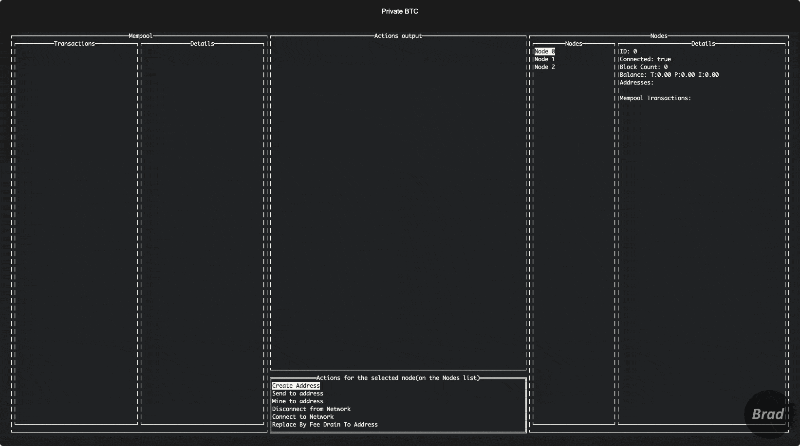
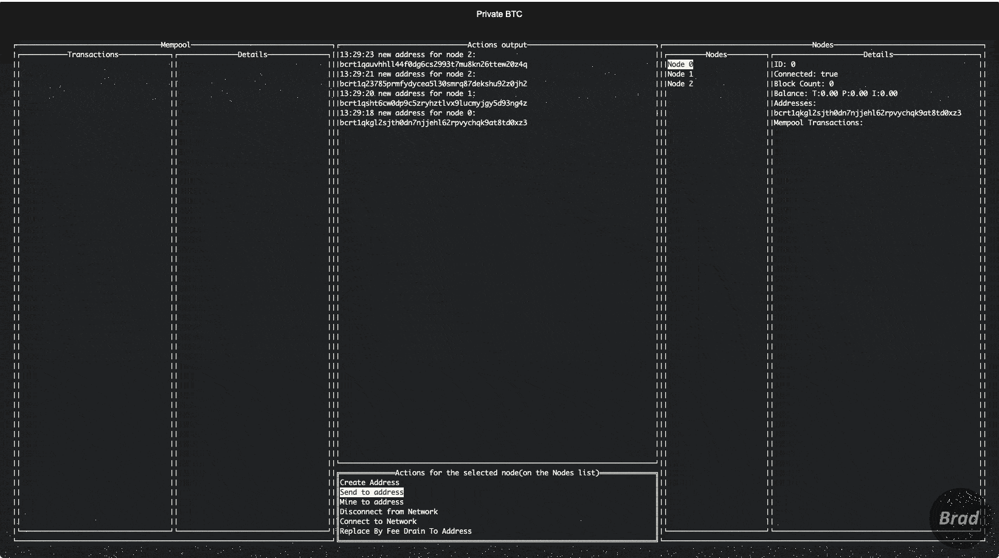

# PrivateBTC - Bitcoin Private Network Management and Testing Tool

[](https://github.com/adrianbrad/privatebtc/blob/main/LICENSE)


[](https://github.com/adrianbrad/privatebtc)
[](https://pkg.go.dev/github.com/adrianbrad/privatebtc)

[](https://www.codefactor.io/repository/github/adrianbrad/privatebtc)
[](https://api.securityscorecards.dev/projects/github.com/adrianbrad/privatebtc)
[](https://bestpractices.coreinfrastructure.org/projects/8016)
[](https://goreportcard.com/report/github.com/adrianbrad/privatebtc)
[](https://codecov.io/gh/adrianbrad/privatebtc)

[](https://github.com/adrianbrad/privatebtc/actions?query=workflow%3Alint-test)
[](https://github.com/adrianbrad/privatebtc/actions?query=workflow%3Arelease)
[](https://github.com/adrianbrad/privatebtc/actions?query=workflow%3Agrype)
[](https://github.com/adrianbrad/privatebtc/actions?query=workflow%3Acodeql)
---

**PrivateBTC** offers a solution for Bitcoin enthusiasts and developers.
It operates as a standalone project with a Terminal User Interface (TUI) for effortless Bitcoin Private Network management.
Simultaneously, it serves as a testing tool, catering to Bitcoin applications developed in Go.

>With **PrivateBTC**, you can easily create a Bitcoin network with multiple nodes, manage addresses, send transactions, mine blocks, and even simulate chain reorganizations programmatically.

This tool is particularly valuable for Go developers working directly with the Bitcoin protocol, allowing them to test their applications' resilience under various scenarios.

>  **Note**: The current version only supports creating Bitcoin nodes with Docker. The plan for future versions is to support other, preferably, native node clients.

---

<!-- TOC -->
* [PrivateBTC - Bitcoin Private Network Management and Testing Tool](#privatebtc---bitcoin-private-network-management-and-testing-tool)
  * [Prerequisites](#prerequisites)
    * [Check environment dependencies](#check-environment-dependencies)
  * [Installation](#installation)
    * [Download pre-built binaries](#download-pre-built-binaries)
    * [Go Install](#go-install)
    * [Building from source](#building-from-source)
    * [Importing in your project](#importing-in-your-project)
  * [Usage](#usage-)
    * [TUI](#tui)
      * [Guide](#guide)
        * [Create Address](#create-address)
        * [Funding and Mining](#funding-and-mining)
        * [Send BTC](#send-btc)
        * [Chain Reorg With Double Spend](#chain-reorg-with-double-spend)
    * [Testing Bitcoin Applications in GO](#testing-bitcoin-applications-in-go)
      * [Private network with 2 nodes and address generation](#private-network-with-2-nodes-and-address-generation)
      * [Chain reorg with double spend](#chain-reorg-with-double-spend-1)
  * [Known Issues](#known-issues)
<!-- TOC -->

---

## Prerequisites
Before you can use this project, please ensure that you have the following prerequisites met:

1. **Docker Daemon**: This project relies on Docker for containerization. 
Make sure you have Docker installed and the Docker daemon running on your machine. 
If Docker is not installed, you can download and install it from the official Docker website: [Docker Installation Guide](https://docs.docker.com/get-docker/).
Docker provides a convenient way to start Bitcoin nodes in isolation.
You can verify that the Docker daemon is running by executing the following command in your terminal:
    ```sh
    docker info
    ```

### Check environment dependencies
  A subcommand is provided to check if the environment dependencies are met.
  ```shell
  privatebtc envcheck
  ```

---

## Installation
### Download pre-built binaries

- [Mac .tar.gz](https://github.com/adrianbrad/privatebtc/releases/download/v0.1.1/privatebtc-v0.1.1-darwin-all.tar.gz)
- [Linux Arm64 .tar.gz](https://github.com/adrianbrad/privatebtc/releases/download/v0.1.1/privatebtc-v0.1.1-linux-arm64.tar.gz)
- [Linux Intel .tar.gz](https://github.com/adrianbrad/privatebtc/releases/download/v0.1.1/privatebtc-v0.1.1-linux-x86_64.tar.gz)

---

### Go Install
1. **Run the go install command:**
This will add the `privatebtc` command to your `$GOPATH/bin` directory.
  ```shell
  go install github.com/adrianbrad/privatebtc/cmd/privatebtc@latest
  ```

2. **Run the TUI:**
  ```shell
  privatebtc
  ```

---

### Building from source

1. **Clone the repo:**
  ```shell
  git clone https://github.com/adrianbrad/privatebtc
  ```

2. **Build the command binary:**
  ```shell
  go build -o privatebtc ./cmd
  ```   

3. **Run the TUI:**
  ```shell
  ./privatebtc
  ```   

---

### Importing in your project

1. **Add this package as a dependency to your project:**

  ```shell
  go get -u github.com/adrianbrad/privatebtc
  ```

2. **Import the package in your project:**
  ```go
  import "github.com/adrianbrad/privatebtc"
  ```

---

## Usage 

### TUI

---

#### Guide

1. **Switching Focus Between Panels:**
   - Use the **Left and Right Arrow Keys** to move focus between the following panels in sequence:
   Transactions -> Mempool -> Details -> Actions Output -> Nodes -> Details.

2. **Selecting an Action:**

   - Once focused on the **Actions** panel, use the **Up and Down Arrow Keys** to navigate through the available items.
   - Press **Enter** to confirm and perform the selected action.

3. **Navigating Inside Modals:**

   - If a modal (like the one labeled "Mine Blocks") appears:
     - Use the **Tab key** to cycle through different fields or buttons inside the modal.
     - Make your selection or input using the **Enter** key.
     - Press **Esc** to exit or dismiss the modal without making a selection or action.

---

##### Create Address


In order to create a new Address, select the node you want to create the address on, 
by focusing on the **Nodes** panel and using the **Up and Down Arrow Keys** to navigate through the available items.
After you have selected the node, move the focus on the **Actions** panel and select the **Create Address** action.

##### Funding and Mining


In order to fund a node, select the node you want to fund, 
by focusing on the **Nodes** panel and using the **Up and Down Arrow Keys** to navigate through the available items.
After you have selected the node, move the focus to the **Actions** panel and select the **Mine to Address** action.
A modal will appear, asking you to input the number of blocks you want to mine and the address to where to send the coinbase reward.

##### Send BTC

In order to send BTC from one node to another, select the node you want to send BTC from, 
by focusing on the **Nodes** panel and using the **Up and Down Arrow Keys** to navigate through the available items.
After you have selected the node, move the focus to the **Actions** panel and select the **Send to address** action.
A modal will appear, asking you to input the address to where to send the BTC and the amount to send.
In order to confirm the transaction, a new block has to be mined on the network, 
you can find more details about this in the [Funding and Mining](#funding-and-mining) section.

##### Chain Reorg Involving Double Spend


To successfully execute a double spend, wherein both transactions are valid and initially mined in separate blocks before a chain reorganization resolves the conflict, follow these steps:

1. **Selection of the Node**: Navigate to the **Nodes** panel. Use the **Up and Down Arrow Keys** to sift through and select the node from which you wish to initiate the double spend.

2. **Initiate a Transaction**: Refer to the [Send BTC](#send-btc) section and execute the necessary steps to send a transaction.

3. **Verification Across Mempools**: Confirm that other nodes have received the transaction in their mempools.

4. **Disconnect the Chosen Node**: Opt for the **Disconnect from network** action to isolate the node.

5. **Replace the Transaction**: Choose the **Replace By Fee Drain To Address** action. This will reroute the cumulative total of the original transaction's inputs to a different address.

6. **First Confirmation**:
    - Connect to a node that's still part of the network and mine a block.
    - This will confirm the initial transaction, effectively transferring the funds.

7. **Second Confirmation**:
    - Now, mine a block on the node you previously disconnected.
    - This action will validate the second transaction, reallocating the funds once again.

8. **Reconnect and Fork**: Re-integrate the previously isolated node back into the network. At this point, you'll observe two chains of equal length, signaling a fork in the blockchain.

9. **Resolve the Fork**:
    - Mine an additional block, either on the main network or on the previously disconnected node.
    - Depending on where you choose to mine this block, one of the two transactions will be negated, while the other remains validated. The blockchain reorganization will ensure that the longer chain is accepted, thereby resolving the double-spend attempt.
---
### Testing Bitcoin Applications in GO

#### Private network with 2 nodes and address generation

```go
package app_test

import (
  "context"
  "testing"

  "github.com/adrianbrad/privatebtc"
  "github.com/adrianbrad/privatebtc/btcsuite"
  "github.com/adrianbrad/privatebtc/docker/testcontainers"
)

func TestApp(t *testing.T) {
  pn, err := privatebtc.NewPrivateNetwork(
    &testcontainers.NodeService{},
    &btcsuite.RPCClientFactory{},
    2,
    privatebtc.WithWallet(t.Name()),
  )
  if err != nil {
    t.Fatalf("new private network error: %s", err)
  }

  t.Cleanup(func() {
    if err := pn.Close(); err != nil {
      t.Logf("close private network error: %s", err)
    }
  })

  ctx := context.TODO()

  if err := pn.Start(ctx); err != nil {
    t.Fatalf("start private network error: %s", err)
  }

  const addressLabel = "label"

  addr, err := pn.Nodes()[0].RPCClient().GetNewAddress(ctx, addressLabel)
  if err != nil {
    t.Fatalf("get new address error: %s", err)
  }

  t.Logf("new address: %s", addr)

  // actual test code here...
}

```
---

#### Chain reorg with double spend

```go
package app_test

import (
  "context"
  "testing"

  "github.com/adrianbrad/privatebtc"
  "github.com/adrianbrad/privatebtc/btcsuite"
  "github.com/adrianbrad/privatebtc/docker/testcontainers"
)

func TestChainReorg(t *testing.T) {
  pn, err := privatebtc.NewPrivateNetwork(
    &testcontainers.NodeService{},
    &btcsuite.RPCClientFactory{},
    2,
    privatebtc.WithWallet(t.Name()),
  )
  if err != nil {
    t.Fatalf("new private network error: %s", err)
  }

  t.Cleanup(func() {
    if err := pn.Close(); err != nil {
      t.Logf("close private network error: %s", err)
    }
  })

  ctx := context.TODO()

  // start the private network,
  if err := pn.Start(ctx); err != nil {
    t.Fatalf("start private network error: %s", err)
  }

  const disconnectedNodeIndex = 0

  // add funds to the node that will be disconnected.
  lastBlockHash, err := pn.Nodes()[disconnectedNodeIndex].Fund(ctx)
  if err != nil {
    t.Fatalf("fund node error: %s", err)
  }

  // sync all nodes to the last block hash.
  if err := pn.Nodes().Sync(ctx, lastBlockHash); err != nil {
    t.Fatalf("sync nodes to block hash %q: %s", lastBlockHash, err)
  }

  // generate an address on the node that will be disconnected.
  disconnectedNodeAddr, err := pn.Nodes()[disconnectedNodeIndex].RPCClient().GetNewAddress(ctx, "label")
  if err != nil {
    t.Fatalf("generate node %d addr: %s", disconnectedNodeIndex, err)
  }

  // generate an address on node 1.
  node1Addr, err := pn.Nodes()[1].RPCClient().GetNewAddress(ctx, "label")
  if err != nil {
    t.Fatalf("generate node 1 addr: %s", err)
  }

  // send a tx from the disconnected node to node 1.
  txHash, err := pn.Nodes()[disconnectedNodeIndex].RPCClient().SendToAddress(ctx, node1Addr, 1)
  if err != nil {
    t.Fatalf("send to address error: %s", err)
  }

  // prepare the chain reorg
  cr, err := pn.NewChainReorgWithAssertion(disconnectedNodeIndex)
  if err != nil {
    t.Fatalf("new chain reorg error: %s", err)
  }

  // disconnect the specified disconnected node.
  if _, err := cr.DisconnectNode(ctx); err != nil {
    t.Fatalf("disconnect node error: %s", err)
  }

  // replace the transaction with a transaction that drains the funds to the specified address.
  if _, err := privatebtc.ReplaceTransactionDrainToAddress(
    ctx,
    pn.Nodes()[disconnectedNodeIndex].RPCClient(),
    txHash,
    disconnectedNodeAddr,
  ); err != nil {
    t.Fatalf("replace transaction drain to address error: %s", err)
  }

  // at this point we have to transactions that spend the same funds, one of them will be dropped.
  // blocks will be mined on the network and on the disconnected node, as long as the nodes are
  // the longest chain will be selected as the main chain.

  const netNumBlocks = 1

  // mine 2 blocks on the network.
  if _, err := cr.MineBlocksOnNetwork(ctx, netNumBlocks); err != nil {
    t.Fatalf("mine blocks on network error: %s", err)
  }

  const discNumBlocks = netNumBlocks + 1

  // mine 2 blocks on the disconnected node.
  if _, err := cr.MineBlocksOnDisconnectedNode(ctx, discNumBlocks); err != nil {
    t.Fatalf("mine blocks on disconnected node error: %s", err)
  }

  // reconnect the specified disconnected node.
  if err := cr.ReconnectNode(ctx); err != nil {
    t.Fatalf("reconnect node error: %s", err)
  }

  // as soon as the node is reconnected, it will start syncing with the network.
  // the network will select the longest chain as the main chain, with the longest
  // chain being the one on the disconnected node, the transaction that send funds
  // to node 1 will be dropped, and the transaction that replaced it, sending funds
  // back to the disconnected block will be included in the chain.
}
```

---

## Known Issues

**PrivateBTC** fails if 
 - you do not have docker installed on your machine.